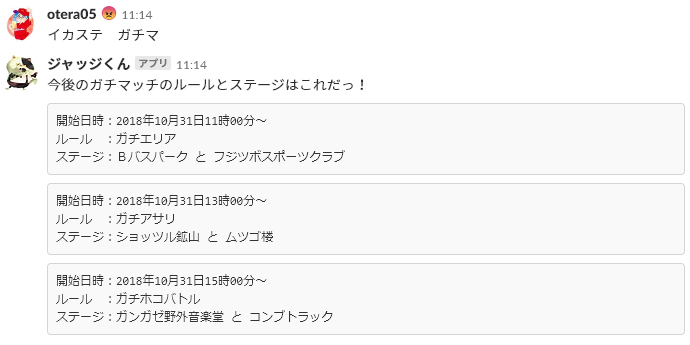

# ikastagebot

### 概要
Slack の Outgoing Webhooksを利用したスプラトゥーン2のステージ情報を答えてくれるBotスクリプト。  
実行環境はAWS Lambdaを想定しています。


### 使い方
```
$ git clone https://github.com/otera05/ikastagebot
$ pip install -r requirements.txt
```

1. プロジェクトをzip圧縮してLambdaにデプロイ
2. API Gatewayを作成してLambdaと連携
3. Slack で Outgoing Webhooks を作成し、API Gateway のエンドポイントを設定する

### 実行結果

